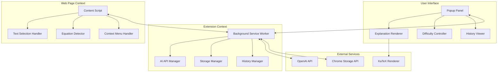
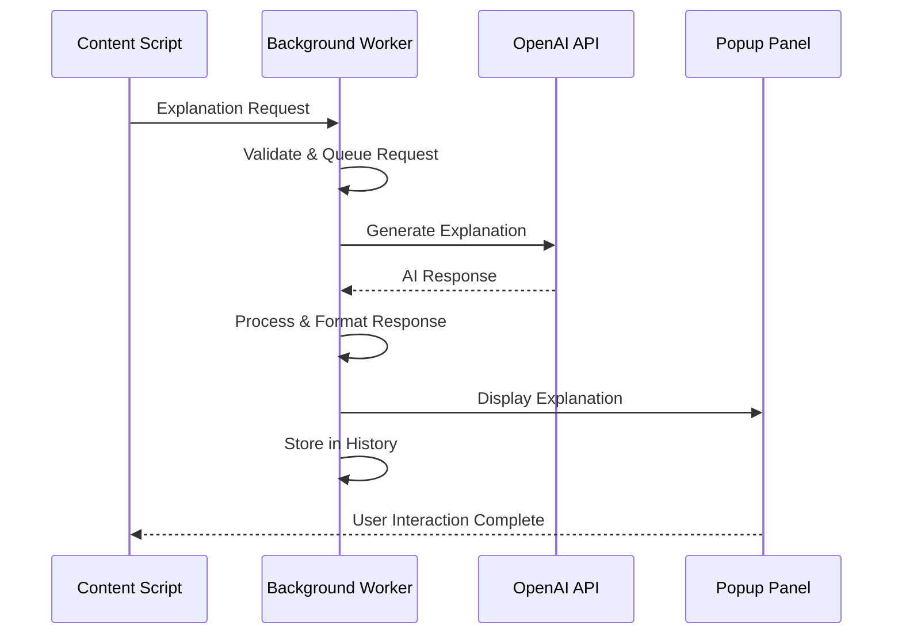

# Design Document

## Overview

Conceptly is a Chrome browser extension built on Manifest V3 that provides intelligent, context-aware explanations of technical terms, programming concepts, and mathematical equations found on web pages. The system leverages AI-powered natural language processing to deliver multi-level explanations tailored to user expertise levels.

## Architecture

### System Architecture

The Conceptly extension follows a distributed architecture with clear separation of concerns:



### High-Level Design

The extension operates through four main architectural layers:

1. **Content Layer**: Injected scripts that interact with web page content
2. **Background Layer**: Service worker handling API calls and data management
3. **UI Layer**: Popup interface and explanation rendering components
4. **Storage Layer**: Local data persistence and history management

### Component Design

#### Content Script Components

**TextSelectionHandler**
- Monitors text selection events using `document.addEventListener('selectionchange')`
- Validates selection length and content type
- Triggers explanation request pipeline
- Provides visual feedback for valid selections

**EquationDetector**
- Uses regex patterns to identify mathematical expressions: `/(\\[.*?\\]|\$.*?\$|\\begin\{.*?\}.*?\\end\{.*?\})/g`
- Implements MathJax/KaTeX detection for rendered equations
- Creates overlay indicators for detected equations
- Handles both inline and block-level mathematical content

**ContextMenuHandler**
- Registers context menu items via `chrome.contextMenus.create()`
- Processes right-click events on selected text
- Integrates with Chrome's native context menu system
- Passes selected content to background script for processing

#### Background Service Worker Components

**AIAPIManager**
- Manages OpenAI API communication with rate limiting
- Implements request queuing and retry logic
- Handles API key management and authentication
- Processes explanation requests based on difficulty level

```javascript
class AIAPIManager {
  async generateExplanation(text, difficulty, explanationType) {
    const prompt = this.buildPrompt(text, difficulty, explanationType);
    const response = await this.callOpenAI(prompt);
    return this.parseResponse(response);
  }
  
  buildPrompt(text, difficulty, type) {
    const templates = {
      'eli5': `Explain "${text}" in simple terms for a ${difficulty} level learner...`,
      'analogy': `Create a real-world analogy for "${text}" at ${difficulty} level...`,
      'stepwise': `Break down "${text}" step-by-step for ${difficulty} understanding...`
    };
    return templates[type];
  }
}
```

**StorageManager**
- Abstracts Chrome Storage API operations
- Implements data encryption for sensitive information
- Manages storage quotas and cleanup operations
- Provides synchronization across browser instances

**HistoryManager**
- Tracks explanation requests and user interactions
- Implements search and filtering capabilities
- Manages data retention policies
- Provides export/import functionality

#### UI Layer Components

**PopupPanel**
- Renders explanation interface using Shadow DOM for isolation
- Implements draggable and resizable functionality
- Manages component lifecycle and state
- Handles keyboard navigation and accessibility

**ExplanationRenderer**
- Processes and displays multi-format explanations
- Integrates KaTeX for mathematical expression rendering
- Implements syntax highlighting for code snippets
- Supports dynamic content updates

**DifficultyController**
- Manages user expertise level selection
- Triggers explanation regeneration on level changes
- Persists user preferences across sessions
- Provides visual feedback for active difficulty level

## Data Flow Description

### Text Selection Flow

1. **Selection Detection**: Content script monitors `selectionchange` events
2. **Content Validation**: Selected text is analyzed for technical content
3. **Visual Feedback**: Selection is highlighted if explanation-worthy content is detected
4. **User Action**: User triggers explanation via highlight click or context menu
5. **Request Processing**: Background script receives explanation request
6. **AI Processing**: Request is sent to AI API with appropriate context and difficulty level
7. **Response Handling**: AI response is processed and formatted
8. **UI Rendering**: Explanation is displayed in popup panel
9. **History Storage**: Interaction is logged to user's learning history

### Equation Detection Flow

1. **Page Analysis**: Content script scans page content using mathematical expression patterns
2. **Pattern Matching**: Regex and DOM analysis identify potential equations
3. **Validation**: Detected expressions are validated for mathematical content
4. **Visual Indicators**: Subtle overlays are added to detected equations
5. **User Interaction**: Click on indicator triggers explanation request
6. **Specialized Processing**: Mathematical content receives specialized AI prompts
7. **Enhanced Rendering**: KaTeX renders mathematical expressions in explanations

### API Request/Response Cycle



## Chrome Extension Architecture (Manifest V3)

### Manifest Configuration

```json
{
  "manifest_version": 3,
  "name": "Conceptly",
  "version": "1.0.0",
  "description": "AI-powered explanations for technical content",
  "permissions": [
    "storage",
    "contextMenus",
    "activeTab"
  ],
  "host_permissions": [
    "https://api.openai.com/*"
  ],
  "background": {
    "service_worker": "background.js"
  },
  "content_scripts": [{
    "matches": ["<all_urls>"],
    "js": ["content.js"],
    "css": ["content.css"]
  }],
  "action": {
    "default_popup": "popup.html"
  }
}
```

### Service Worker Architecture

The background service worker handles:
- API communication with external services
- Cross-tab message routing
- Storage operations and data management
- Context menu registration and handling
- Extension lifecycle management

### Content Script Integration

Content scripts operate in isolated environments with:
- DOM access for text selection and equation detection
- Message passing to background worker
- Dynamic UI injection capabilities
- Event listener management for user interactions

## API Design (AI Integration)

### OpenAI Integration

**Request Structure**
```javascript
const apiRequest = {
  model: "gpt-4",
  messages: [{
    role: "system",
    content: "You are an expert technical educator..."
  }, {
    role: "user", 
    content: `Explain "${selectedText}" at ${difficultyLevel} level`
  }],
  max_tokens: 1000,
  temperature: 0.7
};
```

**Response Processing**
- Parse structured AI responses into explanation categories
- Extract code snippets and format with syntax highlighting
- Identify mathematical expressions for KaTeX rendering
- Generate visual explanation suggestions

**Rate Limiting & Caching**
- Implement exponential backoff for API failures
- Cache frequently requested explanations locally
- Queue requests during high-traffic periods
- Provide offline fallback for cached content

## Database / Storage Design

### Chrome Local Storage Schema

```javascript
const storageSchema = {
  // User preferences
  userPreferences: {
    defaultDifficulty: 'intermediate',
    enabledExplanationTypes: ['eli5', 'analogy', 'stepwise'],
    keyboardShortcuts: {...},
    uiPreferences: {...}
  },
  
  // Learning history
  learningHistory: [{
    id: 'uuid',
    timestamp: 'ISO-8601',
    originalText: 'encrypted-text',
    explanation: 'encrypted-explanation',
    difficulty: 'beginner|intermediate|advanced',
    sourceUrl: 'page-url',
    tags: ['programming', 'javascript']
  }],
  
  // Cached explanations
  explanationCache: {
    'text-hash': {
      explanation: {...},
      timestamp: 'ISO-8601',
      accessCount: 5
    }
  }
};
```

### Data Encryption

Sensitive user data is encrypted using Web Crypto API:
```javascript
async function encryptData(data, key) {
  const encoder = new TextEncoder();
  const dataBuffer = encoder.encode(JSON.stringify(data));
  const encrypted = await crypto.subtle.encrypt(
    { name: 'AES-GCM', iv: crypto.getRandomValues(new Uint8Array(12)) },
    key,
    dataBuffer
  );
  return encrypted;
}
```

## UI/UX Design

### Popup Panel Design

The explanation interface features:
- **Tabbed Layout**: Separate tabs for different explanation types
- **Responsive Design**: Adapts to various screen sizes and orientations
- **Accessibility**: Full keyboard navigation and screen reader support
- **Customization**: User-configurable appearance and behavior

### Visual Design System

```css
:root {
  --primary-color: #2563eb;
  --secondary-color: #64748b;
  --success-color: #059669;
  --warning-color: #d97706;
  --error-color: #dc2626;
  --background: #ffffff;
  --surface: #f8fafc;
  --text-primary: #0f172a;
  --text-secondary: #475569;
}
```

### Interaction Patterns

- **Progressive Disclosure**: Advanced features revealed based on user expertise
- **Contextual Help**: Inline guidance for complex features
- **Feedback Systems**: Visual confirmation for user actions
- **Error Recovery**: Clear paths to resolve issues

## Security Considerations

### Content Security Policy

```json
{
  "content_security_policy": {
    "extension_pages": "script-src 'self'; object-src 'self'; connect-src https://api.openai.com"
  }
}
```

### Data Protection

- **Local Storage Only**: No user data transmitted to external servers except AI API requests
- **Encryption**: Sensitive data encrypted before storage
- **Minimal Permissions**: Request only necessary browser permissions
- **API Key Security**: Secure storage and transmission of API credentials

### Privacy Measures

- **Data Minimization**: Only collect necessary information for functionality
- **User Control**: Complete user control over data retention and deletion
- **Transparency**: Clear disclosure of data usage and storage practices
- **Anonymization**: Remove personally identifiable information from API requests

## Scalability Considerations

### Performance Optimization

**Lazy Loading**
- Load explanation components only when needed
- Implement virtual scrolling for large history lists
- Use intersection observers for equation detection

**Memory Management**
- Implement LRU cache for explanations
- Clean up event listeners and DOM references
- Use WeakMap for temporary object associations

**Network Optimization**
- Batch API requests when possible
- Implement request deduplication
- Use compression for large explanation responses

### Caching Strategy

```javascript
class ExplanationCache {
  constructor(maxSize = 1000) {
    this.cache = new Map();
    this.maxSize = maxSize;
  }
  
  get(key) {
    if (this.cache.has(key)) {
      // Move to end (most recently used)
      const value = this.cache.get(key);
      this.cache.delete(key);
      this.cache.set(key, value);
      return value;
    }
    return null;
  }
  
  set(key, value) {
    if (this.cache.size >= this.maxSize) {
      // Remove least recently used
      const firstKey = this.cache.keys().next().value;
      this.cache.delete(firstKey);
    }
    this.cache.set(key, value);
  }
}
```

## Performance Optimization

### Content Script Optimization

- **Debounced Selection Handling**: Prevent excessive API calls during text selection
- **Efficient DOM Queries**: Use optimized selectors and cache DOM references
- **Event Delegation**: Minimize event listener overhead
- **Intersection Observers**: Efficient equation detection on large pages

### Background Script Optimization

- **Request Queuing**: Manage concurrent API requests
- **Response Caching**: Store frequently accessed explanations
- **Memory Cleanup**: Regular garbage collection of unused data
- **Storage Optimization**: Compress stored data and implement cleanup policies

### Rendering Optimization

```javascript
class PerformantRenderer {
  constructor() {
    this.renderQueue = [];
    this.isRendering = false;
  }
  
  async queueRender(component, data) {
    this.renderQueue.push({ component, data });
    if (!this.isRendering) {
      await this.processQueue();
    }
  }
  
  async processQueue() {
    this.isRendering = true;
    while (this.renderQueue.length > 0) {
      const { component, data } = this.renderQueue.shift();
      await this.renderComponent(component, data);
      // Yield to browser for other tasks
      await new Promise(resolve => setTimeout(resolve, 0));
    }
    this.isRendering = false;
  }
}
```

## Deployment Strategy

### Development Workflow

1. **Local Development**: Chrome Developer Mode with unpacked extension
2. **Testing**: Automated testing with Jest and Chrome Extension Testing Library
3. **Build Process**: Webpack bundling with optimization and minification
4. **Quality Assurance**: Manual testing across different websites and scenarios

### Chrome Web Store Deployment

1. **Package Preparation**: Create production build with optimized assets
2. **Store Listing**: Comprehensive description, screenshots, and promotional materials
3. **Review Process**: Submit for Chrome Web Store review and approval
4. **Release Management**: Staged rollout with monitoring and feedback collection

### Continuous Integration

```yaml
# GitHub Actions workflow
name: Build and Test
on: [push, pull_request]
jobs:
  test:
    runs-on: ubuntu-latest
    steps:
      - uses: actions/checkout@v2
      - uses: actions/setup-node@v2
      - run: npm install
      - run: npm test
      - run: npm run build
      - run: npm run lint
```

### Monitoring and Analytics

- **Error Tracking**: Implement error reporting for debugging
- **Usage Analytics**: Track feature usage while respecting privacy
- **Performance Monitoring**: Monitor API response times and success rates
- **User Feedback**: Collect and analyze user feedback for improvements

## Correctness Properties

*A property is a characteristic or behavior that should hold true across all valid executions of a system—essentially, a formal statement about what the system should do. Properties serve as the bridge between human-readable specifications and machine-verifiable correctness guarantees.*

### Property 1: Content Detection Accuracy
*For any* text selection or webpage content, the extension should correctly identify technical terms and mathematical expressions with consistent accuracy across different content types and domains.
**Validates: Requirements 1.1, 1.5**

### Property 2: UI Response Consistency  
*For any* detected technical content or user interaction, the extension should provide appropriate visual feedback and UI responses without disrupting the original page layout or navigation.
**Validates: Requirements 1.2, 1.6, 3.1, 3.2**

### Property 3: Context Menu Integration
*For any* text selection on any webpage, the extension should reliably add the "Explain with Conceptly" option to the context menu and process selections when activated.
**Validates: Requirements 1.3, 1.4**

### Property 4: AI Explanation Generation
*For any* technical term or concept at any difficulty level, the AI engine should generate appropriate explanations including ELI5, analogies, step-by-step breakdowns, examples, and code snippets as applicable.
**Validates: Requirements 2.1, 2.2, 2.3, 2.4, 2.5, 2.6, 2.7**

### Property 5: Performance Requirements
*For any* explanation request or UI interaction, the system should complete processing within specified time limits (3 seconds for AI generation, 2 seconds for difficulty changes, 1 second for startup).
**Validates: Requirements 2.8, 3.4, 6.4, 6.5**

### Property 6: Popup Panel Functionality
*For any* explanation display, the popup panel should include all required controls (difficulty toggle, copy button, bookmark button, close button) and support resizing, dragging, and keyboard shortcuts.
**Validates: Requirements 3.3, 3.5, 3.6, 3.7, 3.8**

### Property 7: Learning History Management
*For any* explanation request, the system should automatically save the interaction to learning history and provide complete history management including search, organization, deletion, and export capabilities.
**Validates: Requirements 4.1, 4.2, 4.3, 4.4, 4.5, 4.6**

### Property 8: Data Persistence and Sync
*For any* user preference or learning history data, the system should persist information locally with encryption, remember settings across sessions, and sync across devices when browser sync is enabled.
**Validates: Requirements 4.7, 4.8, 5.1, 5.2, 9.8**

### Property 9: Privacy Protection
*For any* data handling operation, the extension should only store data locally, encrypt sensitive information, provide export/clear options, and only send requested text to AI services without transmitting personal data.
**Validates: Requirements 5.3, 5.4, 5.5, 5.6**

### Property 10: Cross-Browser Compatibility
*For any* supported browser (Chrome, Firefox, Edge, Safari), the extension should maintain consistent functionality using standard Web Extensions APIs with identical feature availability.
**Validates: Requirements 6.1, 6.2, 6.3**

### Property 11: Resource Efficiency
*For any* normal operation scenario, the extension should use no more than 50MB of RAM and not impact webpage loading performance by more than 100ms.
**Validates: Requirements 6.6, 6.5**

### Property 12: Network Error Handling
*For any* network failure or AI service unavailability, the extension should gracefully handle errors, display appropriate messages, provide cached explanations when available, and allow retry attempts.
**Validates: Requirements 6.7, 6.8, 8.1, 8.2, 8.3**

### Property 13: Accessibility Compliance
*For any* user interface element, the extension should support keyboard navigation, provide ARIA labels, respect system accessibility preferences, allow font size adjustment, maintain color contrast, and support RTL text rendering.
**Validates: Requirements 7.1, 7.2, 7.3, 7.4, 7.5, 7.6, 7.7**

### Property 14: Error Recovery and Logging
*For any* error condition, the extension should log errors appropriately while protecting privacy, inform users about limitations, recover gracefully from failures, and prompt for storage management when needed.
**Validates: Requirements 8.4, 8.5, 8.6, 8.7**

### Property 15: Configuration Management
*For any* user preference or setting, the extension should provide accessible configuration options, allow customization of difficulty levels, explanation types, keyboard shortcuts, equation detection, and popup appearance.
**Validates: Requirements 9.1, 9.2, 9.3, 9.4, 9.5, 9.6, 9.7**

## Error Handling

The extension implements comprehensive error handling across all components:

### Content Script Error Handling
- Graceful degradation when content script injection fails on protected pages
- Fallback mechanisms for DOM manipulation failures
- Safe handling of cross-origin restrictions

### Background Script Error Handling  
- Retry logic with exponential backoff for API failures
- Queue management for handling request overload
- Storage quota management and cleanup procedures

### UI Error Handling
- User-friendly error messages for all failure scenarios
- Fallback content when explanations cannot be generated
- Recovery options for network and service failures

## Testing Strategy

The Conceptly extension employs a dual testing approach combining unit tests for specific scenarios and property-based tests for comprehensive coverage:

### Unit Testing Focus
- **Specific Examples**: Test concrete cases like "explain recursion" or "detect quadratic formula"
- **Edge Cases**: Handle empty selections, malformed equations, and boundary conditions  
- **Integration Points**: Verify communication between content scripts and background workers
- **Error Conditions**: Test behavior with invalid inputs, network failures, and storage limits

### Property-Based Testing Focus
- **Universal Properties**: Verify that correctness properties hold across all valid inputs
- **Comprehensive Coverage**: Test with randomly generated technical terms, equations, and user interactions
- **Cross-Browser Validation**: Ensure consistent behavior across all supported browsers
- **Performance Validation**: Verify response times and resource usage across various scenarios

### Property-Based Test Configuration
- **Testing Library**: Use fast-check for JavaScript property-based testing
- **Test Iterations**: Minimum 100 iterations per property test to ensure thorough coverage
- **Test Tagging**: Each property test references its corresponding design document property
- **Tag Format**: `// Feature: conceptly-browser-extension, Property {number}: {property_text}`

### Example Property Test Structure
```javascript
// Feature: conceptly-browser-extension, Property 1: Content Detection Accuracy
fc.assert(fc.property(
  fc.string({ minLength: 5, maxLength: 100 }),
  fc.constantFrom('beginner', 'intermediate', 'advanced'),
  (text, difficulty) => {
    const detectionResult = contentDetector.analyzeTechnicalContent(text);
    const explanation = aiEngine.generateExplanation(text, difficulty);
    
    // Property: If technical content is detected, explanation should be generated
    return !detectionResult.hasTechnicalContent || 
           (explanation !== null && explanation.difficulty === difficulty);
  }
), { numRuns: 100 });
```

Both testing approaches are essential for ensuring the extension's reliability, performance, and correctness across the wide variety of web content and user interactions it will encounter.